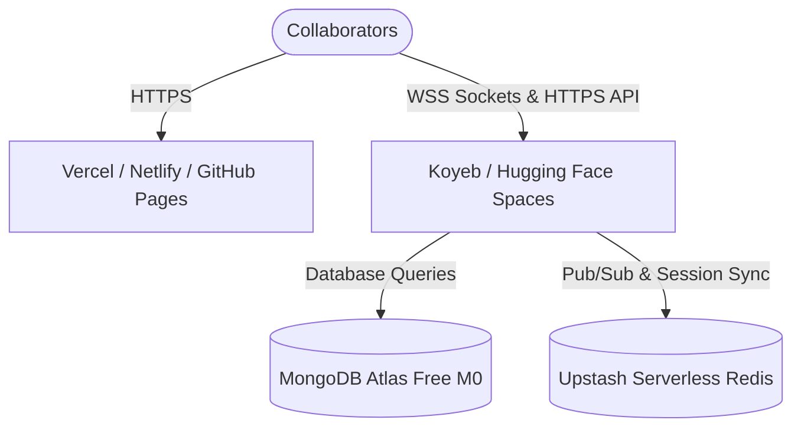

# SyncWrite — Zero-Cost Public Deployment Guide

This guide provides a detailed, step-by-step roadmap to deploy the entire collaborative **SyncWrite** ecosystem (Flutter Web, Node.js + Socket.IO backend, MongoDB, and Redis) publicly to the internet for **100% free**, utilizing modern, high-reliability alternative cloud hosting providers.

---

## 🏗️ Architecture Overview

To achieve a completely free public deployment, we split the architecture into specialized service hosts:



---

## 🗄️ Step 1: Database & Cache Provisioning (Free Tier)

### 1. MongoDB: MongoDB Atlas (M0 Shared Tier)
MongoDB Atlas offers a permanently free, fully managed **M0 database cluster** with 512MB storage, perfect for this application.

1. Sign up/log in at [MongoDB Atlas](https://www.mongodb.com/cloud/atlas/register).
2. Create a new project, select **Build a Database**, and choose the **M0 (Free)** tier.
3. Select your cloud provider (e.g., AWS) and region closest to your users.
4. Under **Security Quickstart**:
   - Create a database user (username and password).
   - In the IP Access List, add **`0.0.0.0/0`** (allows the backend container to connect securely from any cloud host).
5. Go to your cluster, click **Connect -> Drivers**, and copy your **connection string**. It will look like:
   `mongodb+srv://<username>:<password>@cluster0.abcde.mongodb.net/syncwrite?retryWrites=true&w=majority`

### 2. Redis: Upstash (Serverless Redis Free)
Since legacy hostings are deleted, Upstash offers a **100% Free Serverless Redis** tier allowing up to 10,000 commands/day.

1. Sign up at [Upstash Console](https://console.upstash.com/).
2. Click **Create Database**.
3. Name it `syncwrite-redis`, select your preferred region, and create.
4. Scroll down to the **Node.js connection details** and copy your secure **Redis URI** (`rediss://default:...`).

---

## 🚀 Step 2: Backend Deployment (Persistent Free Containers)

Since you have already utilized **Railway** and **Render**, the best alternative free container platforms are **Koyeb** and **Hugging Face Spaces**. We recommend **Koyeb** for its lightning-fast GitHub integration and persistent global CDN.

### Option A: Koyeb (Highly Recommended)
Koyeb offers a permanent free instance for web services deploying directly from GitHub or Docker.

1. Sign up at [Koyeb](https://www.koyeb.com/).
2. Create a **New App**.
3. Select **GitHub** as the deployment method, authorize Koyeb, and choose your repository.
4. Configure the service settings:
   - **Repository Path/Context**: Set to `/server`.
   - **Build & Run Settings**: 
     - Build command: `npm install`
     - Start command: `node index.js`
   - **Port**: Set to **`3005`** (matches our standard port!).
5. Add the **Environment Variables**:
   - `PORT` = `3005`
   - `NODE_ENV` = `production`
   - `MONGO_URI` = `YOUR_MONGODB_ATLAS_URI`
   - `JWT_SECRET_KEY` = `YOUR_PRODUCTION_JWT_SECRET`
   - `GOOGLE_CLIENT_ID` = `YOUR_GOOGLE_CLIENT_ID`
6. Click **Deploy**. Koyeb will compile your code, assign a secure public HTTPS URL (e.g., `https://syncwrite-backend-yourname.koyeb.app`), and spin up the container!

### Option B: Hugging Face Spaces (Docker Sandbox)
Hugging Face offers 100% permanently free Docker container spaces with up to 16GB RAM.

1. Create a free account at [Hugging Face](https://huggingface.co/).
2. Click **New Space**. Name it `syncwrite-backend`.
3. Select **Docker** as the SDK. Choose the **Blank** template.
4. Under visibility, keep it **Public**.
5. Once created, go to **Settings -> Variables and Secrets**, and add your secrets (`MONGO_URI`, `JWT_SECRET_KEY`, etc.).
6. Clone the Space repository locally, copy the `server/` code (including `Dockerfile` and `package.json`) into the Space repo, and commit. HF will auto-build your container and host it publicly!

---

## 🎨 Step 3: Frontend Deployment (Static Free CDNs)

Since Flutter Web compiles to completely static HTML/JS assets, it can be hosted permanently for **free** on highly performant static hosts like **Vercel** or **Netlify**.

### 1. Compile the Flutter Project Natively
Before deploying, modify your `lib/constants.dart` file to target your live, newly deployed backend URL:
```dart
// lib/constants.dart
const host = 'https://syncwrite-backend-yourname.koyeb.app'; // Your Koyeb/HF backend URL
```

Compile the Flutter web app to production assets:
```bash
flutter build web --release
```
This outputs all compiled static assets into the `/build/web` directory.

### 2. Deploy to Vercel (Fastest & Easiest)
1. Sign up/log in at [Vercel](https://vercel.com).
2. Click **Add New -> Project**.
3. Select your repository.
4. In the Project Configuration:
   - **Framework Preset**: Choose **Other**.
   - **Root Directory**: Select the root of the project.
   - **Build & Development Settings**:
     - Build Command: `flutter build web --release`
     - Output Directory: **`build/web`**
5. Click **Deploy**. Vercel will install Flutter, build the release bundle, and serve it on a secure public HTTPS URL (e.g., `https://syncwrite.vercel.app`).

### 3. Deploy to Netlify (Alternative)
1. Sign up/log in at [Netlify](https://www.netlify.com).
2. Click **Add new site -> Import an existing project**.
3. Select your GitHub repository.
4. In the Site settings:
   - Base directory: `/`
   - Build command: `flutter build web --release`
   - Publish directory: **`build/web`**
5. Click **Deploy site**. Netlify handles the deployment and serves it instantly.

---

## 🔒 Step 4: Configure Google OAuth Credentials

Now that both frontend and backend are deployed publicly, you must update your Google Developer Console so the authentication handshake succeeds:

1. Open the [Google Cloud Console Credentials Page](https://console.cloud.google.com/apis/credentials).
2. Click on your active OAuth 2.0 Client ID.
3. Under **Authorized JavaScript origins**, add:
   - `http://localhost:5000` (for local testing)
   - `https://syncwrite.vercel.app` (your production frontend URL)
4. Under **Authorized redirect URIs**, add:
   - `https://syncwrite.vercel.app/`
5. Save the changes. (Allow up to 5 minutes for Google's global authentication configuration to sync).
